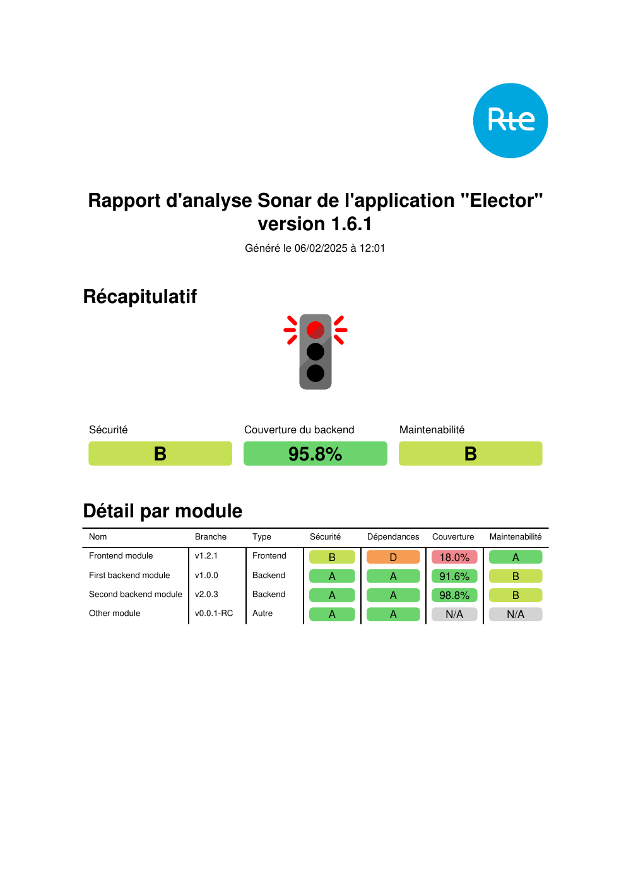

# Sonar report generator for RTE prescription enforcement

## Overview

This project offers a suite of Python packages designed to generate PDF reports that serve as requirements for deploying
applications in RTE production environments.

## Features

- Automatic generation of a PDF report that includes all necessary information for validating the deployment of an application in RTE production environments.
- Utilization of multiple sources for retrieving Sonar metrics (e.g., SonarQube and Sonarcloud), depending on the application module.
- Automatic retrieval of all module metrics directly from Sonar servers for the specified branch (or the default branch if none is explicitly provided).
- Calculation of an aggregated backend code coverage indicator for multi-module application based on [SonarQube description of "coverage" metric](https://docs.sonarsource.com/sonarqube-server/latest/user-guide/code-metrics/metrics-definition/) 
- Generation of a traffic light indicator:
  - **Green light** indicates that all current and future prescription criteria are validated by the application.
  - **Orange light** signifies that while all current prescription criteria are validated, some future ones are not.
  - **Red light** means that some current prescription criteria are not validated.



## Usage

### Build and/or install

A wheel can be built with following command, at base directory of the project:

```shell
python -m build
```

Project can also be directly installed with following command:

```shell
python -m pip install .
```

### Generate Sonar report

Sonar report can be generated with following command:

```shell
python -m rte_sonar_reports -a <path-to-application-description-file> -c <path-to-sonar-configuration-file> -o <path-to-output-report-file>
```

Default log level threshold is set to INFO, but it is possible to override it using the **LOGLEVEL** environment variable.

```shell
LOGLEVEL=ERROR python -m rte_sonar_reports -a ... -c ... -o ...
LOGLEVEL=DEBUG python -m rte_sonar_reports -a ... -c ... -o ...
```

#### Sonar servers configuration

The Sonar servers configuration files is an [ini file](https://en.wikipedia.org/wiki/INI_file) that contains the
connection information to the Sonar instances that may be referenced while generating the final report. Each section of
the file define a Sonar instance used to retrieve static code analysis results.

Supported keys in each section are:

| Key      | Value type | Field type | Description                                                                                                                                               |
|----------|------------|------------|:----------------------------------------------------------------------------------------------------------------------------------------------------------|
| base_url | string     | Mandatory  | Base URL to be used to reach Sonar server using Sonar API                                                                                                 |
| token    | string     | Optional   | Authentication token to get access to the Sonar analysis results. Can be omitted if analysis results are access free (e.g. public analysis on SonarCloud) |

Example:

```ini
[SonarQube]
base_url = https://my.sonarqube.instance
token = my_sonarqube_token

[SonarCloud]
base_url = https://sonarcloud.io
```

#### Application description

The application description allows to define the information needed to define your application and all its attributes
used to generate the final report.

An application is defined by:
- its **name**
- its **version**
- the list of its **modules**. Each module is an individual package which is associated to an individual Sonar project.
  It may be a microservice, a library, or a monolith as soon as its Sonar quality report is contained in a unique Sonar
  project.

A module is defined by:
- its **name**
- its **type** (backend, frontend, ...): type is important because some requirements (e.g. code coverage) may be
  different between backend and frontend. The script does all the following values:
  - *backend*
  - *frontend*
  - *other*
- its **sonar_config** attributes, which is the name of the Sonar configuration to use to retrieve the module's metrics,
  as defined in the [Sonar servers configuration](#sonar-servers-configuration)
- its **project_key** used to locate the project on the Sonar server
- its **branch** to get metrics from

The application description is provided through a yaml formatted file, of the following form:

```yaml
    application:
      name: My complete test application
      version: 1.0.0
      modules:
        - name: Frontend module
          sonar_config: SonarCloud
          project_key: frontend
          type: frontend
        - name: First backend module
          sonar_config: SonarCloud
          project_key: backend
          branch: release-patch-1.0.1
          type: backend
        - name: Second backend module
          sonar_config: SonarQube
          project_key: backend
          type: backend
        - name: Other module
          sonar_config: SonarQube
          project_key: other
          type: other
```

### Proxy settings

The script relies on the proxy configuration defined by standard environment variables http_proxy, https_proxy,
no_proxy, and all_proxy. Uppercase variants of these variables are also supported.
